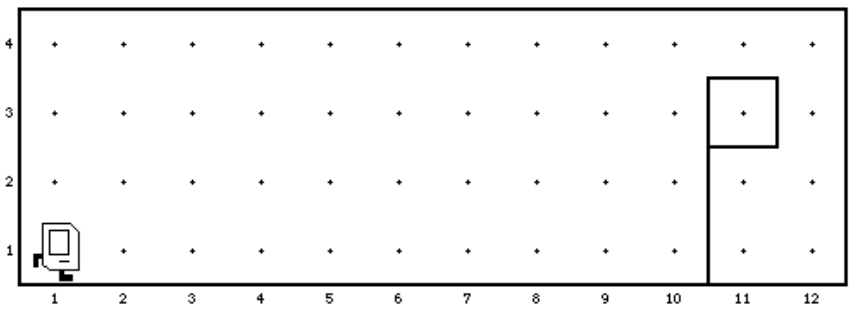
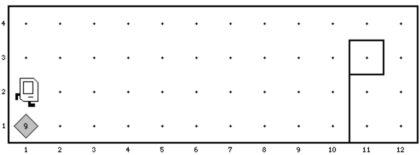

# Aufgabe: Flag-Karel

In dieser Aufgabe soll Karel die Distanz bis zu einer in der Welt aufgestellten Flagge messen.
Das Ergebnis seiner Berechnung lässt sich an einem Stapel Beeper ablesen, den er in der
linken unteren Ecke der Welt ablegt. Die Welt vor dem Start des Programms sieht wie folgt
aus:

Das Ergebnis zeigt die folgende Abbildung (die 9 Beeper stehen für die Entfernung zwischen
Karels Startposition und der Flagge):

Es gelten die folgenden Annahmen:
- Karel steht zu Beginn immer in der linken unteren Ecke der Welt.
- Die Flagge steht immer am unteren Rand der Welt (also auf dem Boden).
- Die Flagge steht immer rechts von Karel.
- Die Flagge kann auch direkt rechts von Karel auf dem Nachbarfeld stehen. In diesem Fall muss das Programm dennoch korrekt funktionieren und Karel darf entsprechend **keinen** Beeper ablegen.

Ihr Programm muss für die im Starterprojekt enthaltenen Welten `flagDistance0` (Ergebnis
0), `flagDistance1` (Ergebnis: 9) und `flagDistance2` (Ergebnis: 24) funktionieren, sowie für
alle anderen Welten, die den oben genannten Kriterien entsprechen. Es spielt keine Rolle, in
welche Richtung Karel am Ende des Programms blickt.

# Karel the Robot

The main file is *karel.c*.

Program structure:

    #include "karel.h"  // Include file with some definitions
    
    // Is called on program start
    void setup (void) {
        // Replace the filename with a valid name in
        // data/world/<name>.w
        loadWorld("LivingRoom");
    }

    void run (void) {
        // Code here is executed when "run" is clicked
    }

# Karel actions:

`move();` - Move one step in current direction   
`turnLeft();` - Turn left 90 degrees  
`putBeeper();` - Put a beeper at current location  
`pickBeeper();` - Pick up a beeper from current location

# Karel sensors:

These functions return 0 or 1 depending if the condition
is fulfilled or not.

`frontIsClear();    frontIsBlocked();`  
`leftIsClear();     leftIsBlocked();`  
`rightIsClear();    rightIsBlocked();`  
`beepersPresent();  noBeepersPresent();`  
`beepersInBag();    noBeepersInBag();`  
`facingNorth();     notFacingNorth();`  
`facingEast();      notFacingEast();`  
`facingSouth();     notFacingSouth();`  
`facingWest();      notFacingWest();`  

# Iterative statements:

    int i;
    for (i=0; i < N; i++) {
        // statements to be repeated N times
    }

    while (<test>) {
        // statements to be repeated until
        // <test> is false
    }

# Function definitions:
    void <functionname> (void) {
        // function body
    }

# Conditional statements:

    if (<test>) {
        // statements to be executed if <test> is true
    }
    
    if (<test>) {
        // statements to be executed if <test> is true
    } else {
        // statements to be executed if <test> is false
    }
