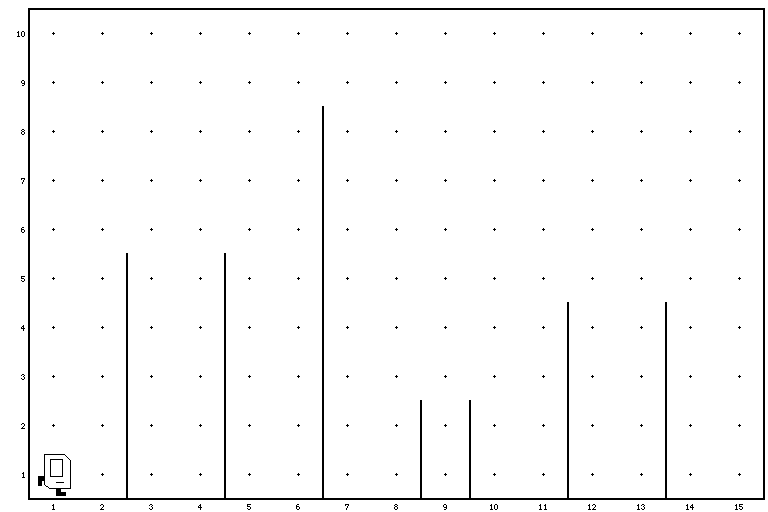

# Aufgabe: Steeple Chase

Karel soll alle Huerden in seiner Welt ueberwinden:

- Karel startet auf Position (1,1) und blickt nach rechts.
- Die Welt ist exakt 15 Felder breit.
- Es koennen beliebig viele und beliebig hohe Huerden auf der Karte vorhanden sein.
- Karel kann nur eine Huerde auf einmal ueberqueren.
- Die Huerden ermoeglichen es Karel sie zu ueberqueren, das heisst, zwischen der Spitze und der Obergrenze der Welt ist mindestens ein Feld frei.

Karel soll am Ende des Programms auf dem Feld rechts unten stehen.

# Karel the Robot

The main file is *karel.c*.

Program structure:

    #include "karel.h"  // Include file with some definitions
    
    // Is called on program start
    void setup (void) {
        // Replace the filename with a valid name in
        // data/world/<name>.w
        loadWorld("LivingRoom");
    }

    void run (void) {
        // Code here is executed when "run" is clicked
    }

# Karel actions:

`move();` - Move one step in current direction   
`turnLeft();` - Turn left 90 degrees  
`putBeeper();` - Put a beeper at current location  
`pickBeeper();` - Pick up a beeper from current location

# Karel sensors:

These functions return 0 or 1 depending if the condition
is fulfilled or not.

`frontIsClear();    frontIsBlocked();`  
`leftIsClear();     leftIsBlocked();`  
`rightIsClear();    rightIsBlocked();`  
`beepersPresent();  noBeepersPresent();`  
`beepersInBag();    noBeepersInBag();`  
`facingNorth();     notFacingNorth();`  
`facingEast();      notFacingEast();`  
`facingSouth();     notFacingSouth();`  
`facingWest();      notFacingWest();`  

# Iterative statements:

    int i;
    for (i=0; i < N; i++) {
        // statements to be repeated N times
    }

    while (<test>) {
        // statements to be repeated until
        // <test> is false
    }

# Function definitions:
    void <functionname> (void) {
        // function body
    }

# Conditional statements:

    if (<test>) {
        // statements to be executed if <test> is true
    }
    
    if (<test>) {
        // statements to be executed if <test> is true
    } else {
        // statements to be executed if <test> is false
    }
