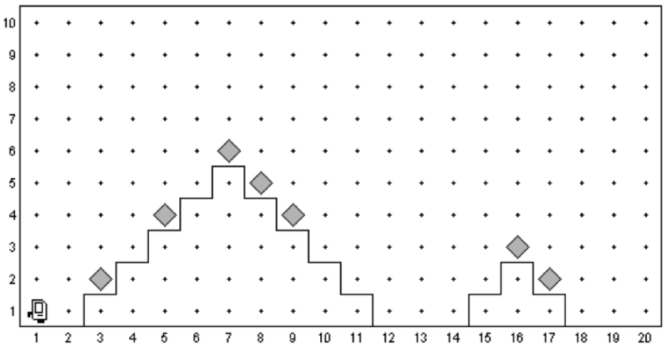

# Aufgabe: Karel und die zwei Pyramiden

Karel lebt in einer Welt, die aus ihm und zwei Pyramiden besteht (ClimbTwoPyramidsKarel). Karel weiß, dass sich auf manchen Pyramidenstufen Beeper befinden. Da Karel Beeper liebt, möchte er nun über beide Pyramiden klettern, um alle Beeper einzusammeln. Karel kennt weder die Höhe der Pyramiden, noch sieht er, auf welchen Pyramidenstufen Beeper liegen.

So ist der Zustand von Karels Welt, bevor er seine Aufgabe ausgeführt hat:

Und so danach:

Karels Wissen über die Welt:

1. Karels Welt ist mindestens so groß, dass er und 2 Pyramiden darin Platz haben
1. Über den Pyramiden muss mindestens ein freies Feld sein, zwischen den Pyramiden mindestens zwei freie Felder und zwischen den Pyramiden und der Wand mindestens ein freies Feld
1. Die Pyramiden sind beliebig groß
1. Jede Pyramidenstufe ist ein Feld tief
1. Auf den Pyramidenstufen kann ein oder kein Beeper liegen

Ausgangs-/Endsituation: Karel steht im Feld (1,1) und schaut nach Osten. Nach dem Überqueren der Pyramiden sollte Karel im Feld (n,1) stehen, alle Beeper eingesammelt haben und wiederum nach Osten schauen.

# Karel the Robot

The main file is *karel.c*.

Program structure:

    #include "karel.h"  // Include file with some definitions
    
    // Is called on program start
    void setup (void) {
        // Replace the filename with a valid name in
        // data/world/<name>.w
        loadWorld("LivingRoom");
    }

    void run (void) {
        // Code here is executed when "run" is clicked
    }

# Karel actions:

`move();` - Move one step in current direction   
`turnLeft();` - Turn left 90 degrees  
`putBeeper();` - Put a beeper at current location  
`pickBeeper();` - Pick up a beeper from current location

# Karel sensors:

These functions return 0 or 1 depending if the condition
is fulfilled or not.

`frontIsClear();    frontIsBlocked();`  
`leftIsClear();     leftIsBlocked();`  
`rightIsClear();    rightIsBlocked();`  
`beepersPresent();  noBeepersPresent();`  
`beepersInBag();    noBeepersInBag();`  
`facingNorth();     notFacingNorth();`  
`facingEast();      notFacingEast();`  
`facingSouth();     notFacingSouth();`  
`facingWest();      notFacingWest();`  

# Iterative statements:

    int i;
    for (i=0; i < N; i++) {
        // statements to be repeated N times
    }

    while (<test>) {
        // statements to be repeated until
        // <test> is false
    }

# Function definitions:
    void <functionname> (void) {
        // function body
    }

# Conditional statements:

    if (<test>) {
        // statements to be executed if <test> is true
    }
    
    if (<test>) {
        // statements to be executed if <test> is true
    } else {
        // statements to be executed if <test> is false
    }
