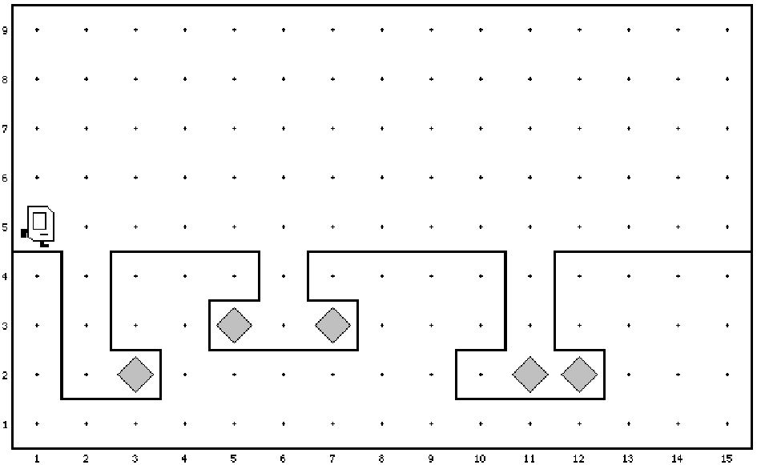
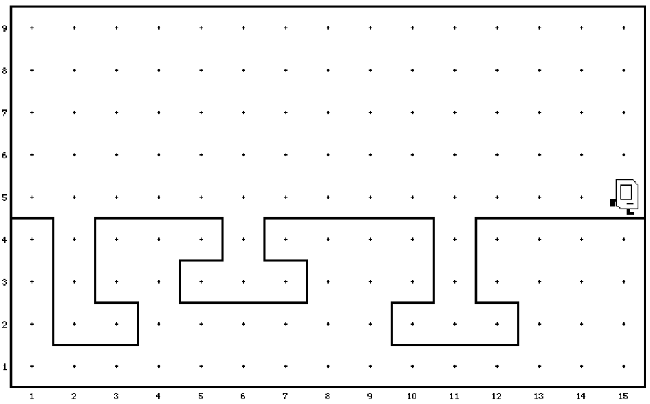

# Aufgabe: Karel und die Diamantenmine

Karel hat einen neuen Job: Diesmal muss er Diamanten aus einer Mine holen.

Karel startet an der Oberfläche und räumt alle Minen aus, die sich in der Welt befinden.
Am Ende des Programms müssen alle Diamanten aufgesammelt worden sein, und Karel
wieder an der Oberfläche am rechten Rand der Welt stehen und nach Osten blicken:

Sie können auf die folgenden Annahmen bauen:

- Jede Mine besteht aus einem Schacht, der mindestens zwei Felder nach unten führt.
- Von jedem Schacht können Tunnel in horizontaler Richtung nach rechts und links
führen.
- Die Tunnel verlaufen immer parallel zur Oberfläche.
- Nicht jeder Schacht muss über Tunnel verfügen.

Achten Sie auf Top-Down Design, d.h. überlegen Sie zuerst, aus welchen Hauptschritten
Ihr Programm besteht, schreiben dafür Funktionen, teilen diese ggf. weiter auf und ergän-
zen diese dann nacheinander, bis Ihr Programm funktioniert. Versuchen Sie Ihr Programm
alle paar Minuten zu testen, um zu sehen, ob Sie vorankommen! Wenn Sie zu viel Code
schreiben ohne zu testen, wird die Fehlersuche oft sehr mühsam.
Ihr Programm muss für die beiden Welten **DiamondMining1** und **DiamondMining2** funktio-
nieren, sowie für alle anderen Welten, die den oben genannten Annahmen entsprechen.

# Karel the Robot

The main file is *karel.c*.

Program structure:

    #include "karel.h"  // Include file with some definitions
    
    // Is called on program start
    void setup (void) {
        // Replace the filename with a valid name in
        // data/world/<name>.w
        loadWorld("LivingRoom");
    }

    void run (void) {
        // Code here is executed when "run" is clicked
    }

# Karel actions:

`move();` - Move one step in current direction   
`turnLeft();` - Turn left 90 degrees  
`putBeeper();` - Put a beeper at current location  
`pickBeeper();` - Pick up a beeper from current location

# Karel sensors:

These functions return 0 or 1 depending if the condition
is fulfilled or not.

`frontIsClear();    frontIsBlocked();`  
`leftIsClear();     leftIsBlocked();`  
`rightIsClear();    rightIsBlocked();`  
`beepersPresent();  noBeepersPresent();`  
`beepersInBag();    noBeepersInBag();`  
`facingNorth();     notFacingNorth();`  
`facingEast();      notFacingEast();`  
`facingSouth();     notFacingSouth();`  
`facingWest();      notFacingWest();`  

# Iterative statements:

    int i;
    for (i=0; i < N; i++) {
        // statements to be repeated N times
    }

    while (<test>) {
        // statements to be repeated until
        // <test> is false
    }

# Function definitions:
    void <functionname> (void) {
        // function body
    }

# Conditional statements:

    if (<test>) {
        // statements to be executed if <test> is true
    }
    
    if (<test>) {
        // statements to be executed if <test> is true
    } else {
        // statements to be executed if <test> is false
    }
