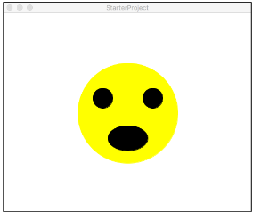

# Ein Smiley ist überrascht!

In dieser Aufgabe können Sie erste Erfahrungen mit der GraphicsApp sammeln. Zeichnen Sie einen überraschten Smiley, wie in der folgenden Abbildung dargestellt.

1. Ihr Programm startet in der Funktion main().
2. Zerlegen Sie das Problem in Teilprobleme und erstellen zuerst die Aufrufe für die Funktionen setupDrawingCanvas() und drawSmiley() in der main() Funktion.
3. Der Smiley muss zentriert auf der Zeichenfläche dargestellt werden, unabhängig von der Größe des Zeichenfelds! Verwenden Sie geeignete Konstanten mit #define (vgl. Beispielcode aus der Vorlesung), um die Breite und Höhe an einer einzigen Stelle in Ihrem Programm zu definieren. Alle anderen Stellen, an denen diese Werte gebraucht werden müssen sich auf diese zentrale Stelle beziehen!
4. Legen Sie die Farben des Smileys ebenfalls in Konstanten fest.
5. Die Größe des Smileys können Sie frei wählen.

# Replit SPL

Documentation to SPL can be found here:

https://cs50.github.io/spl/

