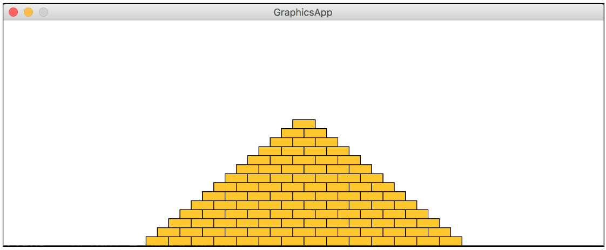

# Aufgabe 4 : Pyramide

Ihr Programm soll eine Pyramide zeichnen, die aus einzelnen Ziegeln besteht, die in horizontalen Linien angeordnet werden. Die Anzahl der einzelnen Blöcke nimmt um einen Block pro Reihe ab: Die Pyramide soll am unteren Ende der Zeichenfläche stehen und in der Mitte zentriert werden.

Verwenden Sie mindestens die folgenden Konstanten:

**BRICK_WIDTH** für die Breite der Ziegel (30).  
**BRICK_HEIGHT** für die Höhe der Ziegel (12).  
**BRICKS_IN_BASE** für die Anzahl der Ziegel der untersten Reihe (14).  

Die angegebenen Zahlen entsprechen der Pyramide auf dem Screenshot, aber Ihre Pyramide muss für unterschiedliche Werte korrekt funktionieren.

# Replit SPL

Documentation to SPL can be found here:

https://cs50.github.io/spl/

