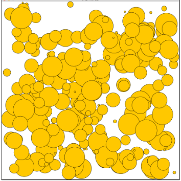

# Aufgabe 7 : Zufällige Kreise und Tastaturevents

Schreiben Sie eine GraphicsApp, die 250 Kreise mit unterschiedlichen Positionen und Durchmessern zeichnet. Dabei soll jeder Kreis einen zufälligen Durchmesser zwischen 5 und 100 Pixeln haben und eine zufällige Position innerhalb der Zeichenfläche. Achten Sie darauf, dass sich dabei der gesamte Kreis immer innerhalb der Zeichenfläche befindet.
Die folgende Abbildung zeigt einen Beispielaufruf des Programms:

Erweitern Sie Ihr Programm so, dass bei jedem Druck auf die Taste n (für neu), weitere Zufallskreise gezeichnet werden.
Verwenden Sie zur Berechnung der zufälligen Werte die Library random.h.

# Replit SPL

Documentation to SPL can be found here:

https://cs50.github.io/spl/

