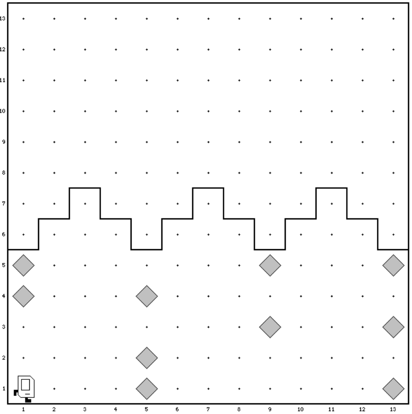
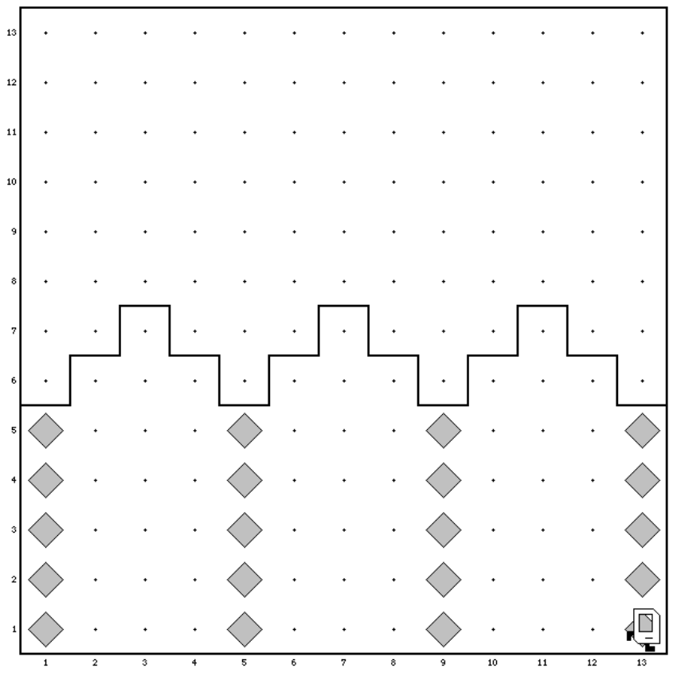

# Aufgabe: Die zerstoerten Saeulen

Bei einer Explosion wurden Säulen zerstört, die das Dach eines Gebäudes tragen. Karel
wurde angeheuert, um diese Säulen zu reparieren. Die zu reparierenden Säulen bestehen
aus Beepern, fehlende Stücke muss Karel ersetzen:

Wenn Karel mit seiner Arbeit fertig ist, müssen die Säulen alle intakt sein, wie auf der folgenden Abbildung dargestellt:

Das Programm muss in der oben dargestellten Welt funktionieren (`DamagedPillar1`), aber
muss allgemein genug sein, um in jeder Welt zu funktionieren, in der die folgenden Bedingungen gelten:
- Karel startet auf dem Feld (1,1) und blickt nach Osten. Er hat eine unendliche Menge an *Beepern* in seinem Beutel.
- Die Säulen sind immer durch 4 Felder getrennt, d.h. sie stehen auf den Feldern (1,1), (1,5), (1,9) usw.
- Die letzte Säule steht immer direkt vor einer Wand und markiert das Ende des Gebäudes, und damit das Ende der Arbeit für Karel. In der Beispielwelt steht die letzte Säule auf Feld (1,13), aber das Programm muss für eine beliebige Anzahl von Säulen funktionieren.
- Das obere Ende einer Säule wird durch eine Wand begrenzt: Karel kann sich aber nicht darauf verlassen, dass alle Säulen immer 5 Felder hoch sind, und auch nicht darauf, dass alle Säulen in einer Welt die gleiche Höhe haben.
- Die Säulen sind noch teilweise intakt: Wenn die Säule auf einem Feld intakt ist, d.h.  ein *Beeper* darauf liegt, dann darf Karel keinen zweiten Beeper auf das Feld legen.

Verwenden Sie die `for`-Anweisung, falls Karel Dinge öfter tun soll und vermeiden Sie damit
doppelten Code zu schreiben. Testen Sie Ihr Programm auch mit der Welt `DamagedPillar2`.

# Karel the Robot

The main file is *karel.c*.

Program structure:

    #include "karel.h"  // Include file with some definitions
    
    // Is called on program start
    void setup (void) {
        // Replace the filename with a valid name in
        // data/world/<name>.w
        loadWorld("LivingRoom");
    }

    void run (void) {
        // Code here is executed when "run" is clicked
    }

# Karel actions:

`move();` - Move one step in current direction   
`turnLeft();` - Turn left 90 degrees  
`putBeeper();` - Put a beeper at current location  
`pickBeeper();` - Pick up a beeper from current location

# Karel sensors:

These functions return 0 or 1 depending if the condition
is fulfilled or not.

`frontIsClear();    frontIsBlocked();`  
`leftIsClear();     leftIsBlocked();`  
`rightIsClear();    rightIsBlocked();`  
`beepersPresent();  noBeepersPresent();`  
`beepersInBag();    noBeepersInBag();`  
`facingNorth();     notFacingNorth();`  
`facingEast();      notFacingEast();`  
`facingSouth();     notFacingSouth();`  
`facingWest();      notFacingWest();`  

# Iterative statements:

    int i;
    for (i=0; i < N; i++) {
        // statements to be repeated N times
    }

    while (<test>) {
        // statements to be repeated until
        // <test> is false
    }

# Function definitions:
    void <functionname> (void) {
        // function body
    }

# Conditional statements:

    if (<test>) {
        // statements to be executed if <test> is true
    }
    
    if (<test>) {
        // statements to be executed if <test> is true
    } else {
        // statements to be executed if <test> is false
    }
