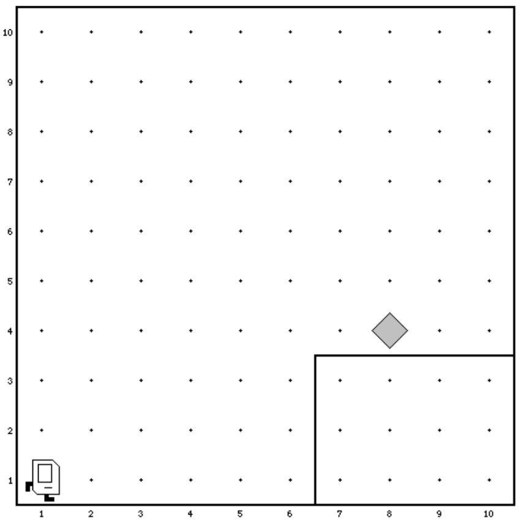

# Aufgabe: Karel und sein Wohnzimmer

Karels Welt sieht in dieser Aufgabe wie folgt aus:

Karel steht in seinem Wohnzimmer (Welt: LivingRoom) und soll, wie in der Vorlesung, den
Beeper auf der Kommode aufsammeln und dann bis zur rechten Wand weitergehen und
dort stehen bleiben.

Dieses Beispiel ist einfach, Sie können auf die folgenden Annahmen bauen: Karel startet in
der Ecke links unten. Die Welt sieht immer exakt so aus wie in der Abbildung dargestellt,
d.h. die Kommode ist gleich hoch und die Größe des Feldes, sowie die Position des Beepers
sind immer gleich.

Die Aufgabe besteht daraus, die Kommandos für Karel zu schreiben, um die folgenden
Teilaufgaben zu lösen.

1. Bis zur Kommode laufen
1. Die Kommode seitlich "hochklettern"
1. Bis zum Beeper laufen
1. Den Beeper aufheben
1. Bis zur Wand weitergehen

# Karel the Robot

The main file is *karel.c*.

Program structure:

    #include "karel.h"  // Include file with some definitions
    
    // Is called on program start
    void setup (void) {
        // Replace the filename with a valid name in
        // data/world/<name>.w
        loadWorld("LivingRoom");
    }

    void run (void) {
        // Code here is executed when "run" is clicked
    }

# Karel actions:

`move();` - Move one step in current direction   
`turnLeft();` - Turn left 90 degrees  
`putBeeper();` - Put a beeper at current location  
`pickBeeper();` - Pick up a beeper from current location

# Karel sensors:

These functions return 0 or 1 depending if the condition
is fulfilled or not.

`frontIsClear();    frontIsBlocked();`  
`leftIsClear();     leftIsBlocked();`  
`rightIsClear();    rightIsBlocked();`  
`beepersPresent();  noBeepersPresent();`  
`beepersInBag();    noBeepersInBag();`  
`facingNorth();     notFacingNorth();`  
`facingEast();      notFacingEast();`  
`facingSouth();     notFacingSouth();`  
`facingWest();      notFacingWest();`  

# Iterative statements:

    int i;
    for (i=0; i < N; i++) {
        // statements to be repeated N times
    }

    while (<test>) {
        // statements to be repeated until
        // <test> is false
    }

# Function definitions:
    void <functionname> (void) {
        // function body
    }

# Conditional statements:

    if (<test>) {
        // statements to be executed if <test> is true
    }
    
    if (<test>) {
        // statements to be executed if <test> is true
    } else {
        // statements to be executed if <test> is false
    }
