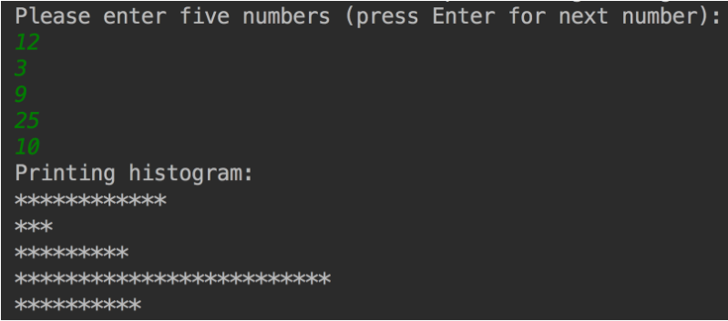

# Aufgabe: Histogramm

Eine wichtige Anwendung von Computern ist das Visualisieren mit Histogrammen und anderen Grafiken. Schreiben Sie ein Programm, das fünf Zahlen einliest. Die Zahlen liegen
jeweils zwischen 1 und 30. Nehmen Sie der Einfachheit halber an, dass die Benutzer nur
gültige Zahlen eingeben.

Für jede eingelesene Zahl soll Ihr Programm die entsprechende Zahl an Sternchen ausgeben. Die Ausgabe Ihres Programms sollte in etwa wie folgt aussehen:

Versuchen Sie Ihr Programm in Funktionen zu unterteilen. Überlegen Sie dazu zunächst,
welchen Code Sie in Funktionen auslagern könnten.

# Replit SPL

Documentation to SPL can be found here:

https://cs50.github.io/spl/

