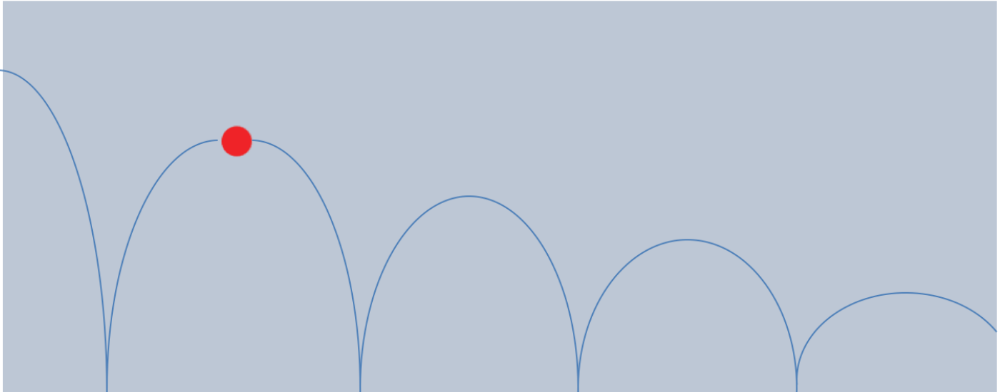

# Aufgabe 5 : Ball mit Physik

Erstellen Sie eine GraphicsApp, die einen Ball von links nach rechts über die Zeichenfläche
springen lässt:  

Der Ball startet in der linken oberen Ecke, fällt dann zu Boden und prallt wieder ab, solange
er nicht den Bildschirm verlassen hat.

Auf den Ball wirken zwei Einflußfaktoren:
- Die Schwerkraft drückt von oben auf den Ball und vermindert die Geschwindigkeit des Balls bei jedem Animationsschritt um einen konstanten Wert (z.B. 0.15)
- Bei jedem Aufprall gibt der Ball einen Teil seiner Energie ab. Legen Sie eine Konstante an, die angibt, wieviel Energie (= vertikale Geschwindigkeit) der Ball nach dem Aufprall auf den Boden noch behält (z.B. 0.9).
Die horizontale Geschwindigkeit des Balls ist während des gesamten Programms konstant.

Tipp: Speichern Sie den Ball und seine Geschwindigkeit (d.h. Positionsveränderung bei je-
dem Animationsschritt) in geeigneten Variablen ab. Bei jedem Durchlauf von der Animationsschleife sollte Ihr Programm den Ball auf seine neue Position setzen und anschließend überprüfen, ob der Ball auf den Boden geprallt ist. Wenn der Ball auf den Boden getroffen ist, dann verändern Sie seine Geschwindigkeit.

# Replit SPL

Documentation to SPL can be found here:

https://cs50.github.io/spl/

