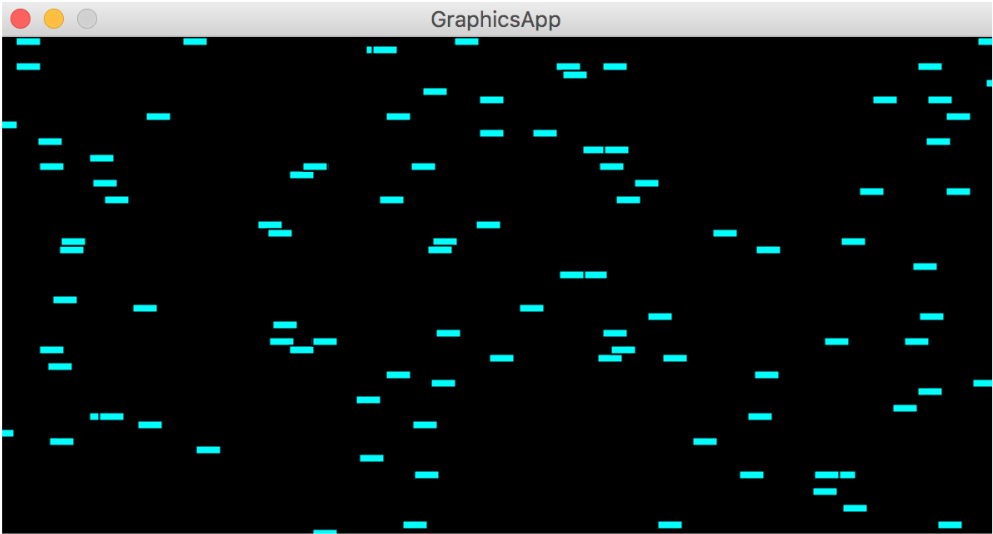

# Aufgabe 5 : Car-Simulator

Erstellen Sie ein Programm, das den Verkehr auf einer mehrspurigen Straße animiert:
- Alle Fahrzeuge starten am linken Rand der Zeichenfläche.
- Die Fahrzeuge fahren in Spuren, jede Spur ist so hoch wie die Fahrzeuge (die Fahrzeughöhe ist konstant).
- Auf einer Spur können mehrere Fahrzeuge mit unterschiedlichen Geschwindigkeiten
fahren.
- Fährt ein Fahrzeug rechts aus dem Bild heraus, so wird seine Position wieder auf den
Anfang der selben Spur gesetzt und die Geschwindigkeit wieder zufällig berechnet.
- Die Geschwindigkeit des Fahrzeugs wird ebenfalls zufällig bestimmt (zwischen **1** und
**MAX_SPEED** Pixeln pro Animationsschritt).

Hinweise zur Bearbeitung:
- Sehen Sie sich die beiden Arrays **cars** und **carSpeeds** im Codegerüst
an. Welche Daten werden dort verwaltet? Wann werden diese im Programm befüllt,
wann wieder ausgelesen?
- Zur Berechnung der zufälligen Geschwindigkeit und der zufälligen Spur der Fahrzeuge steht Ihnen die Library *random.h* zur Verfügung, siehe: https://cs50.github.io/spl/random.html

# Replit SPL

Documentation to SPL can be found here:

https://cs50.github.io/spl/

